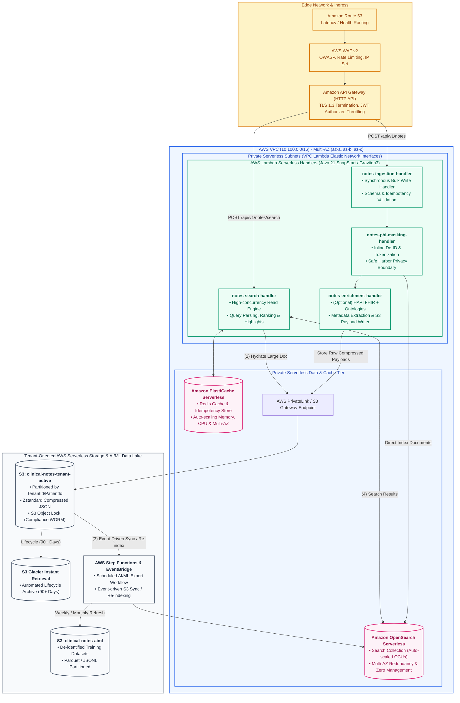

# Serverless Deployment & Infrastructure Architecture Guide: AWS Stack

> **Enterprise Serverless Deployment Guide for Notes Aggregator on Amazon Web Services (AWS) using Java 21 / AWS Lambda SnapStart / OpenSearch Serverless**

---

## 1. Executive Serverless Deployment Overview

This document specifies the target enterprise architecture, technical stack, managed AWS serverless cloud services, state stores, networking, security controls, and operational runbooks for deploying the **Clinical Notes Aggregator System** in a high-availability, HIPAA-compliant, fully serverless AWS environment.



---

## 2. Serverless Technical Stack Specification (Java 21 & AWS Services)

The backend microservices are built on a serverless Java enterprise stack leveraging **Java 21 LTS** on **AWS Lambda** with **AWS Lambda SnapStart** (Firecracker MicroVM snapshotting) to eliminate cold starts and deliver sub-millisecond execution times without container orchestration or cluster management.

| Layer / Component | Technology / Managed Service | Version / Details | Purpose |
| :--- | :--- | :--- | :--- |
| **Serverless Compute** | **AWS Lambda** (Java 21 Managed Runtime) | Amazon Linux 2023 / Java 21 (ARM64) | Zero-server compute scaling instantaneously to tens of thousands of concurrent requests. |
| **Cold Start Mitigation** | **AWS Lambda SnapStart** + **Provisioned Concurrency** | MicroVM snapshot restore (<10ms) | Guarantees instant execution for high-volume clinical synchronous writes and reads. |
| **API Gateway & Ingress** | **Amazon API Gateway (HTTP APIs)** | HTTP/2 & TLS 1.3 | Low-latency API ingress, built-in OAuth2/OIDC JWT Authorizers, and per-client throttling. |
| **Edge Security** | **AWS WAF v2** | Regional WAF | Layer 7 firewall with rate limiting, IP reputation, and OWASP Top 10 protection rules. |
| **PHI Masking & Security** | **Tink / Fast Stream Tokenizer** | `com.google.crypto.tink:tink:1.13+` | High-speed inline format-preserving encryption and regex/NER-based PHI redactor. |
| **Search Engine (Serverless)** | **Amazon OpenSearch Serverless (AOSS)** | OpenSearch 2.x API Compatible | Managed search collections scaling automatically in OpenSearch Compute Units (OCUs). |
| **Caching (Serverless)** | **Amazon ElastiCache Serverless for Redis** | Redis 7.1+ compatible | Instantaneously auto-scaled memory and compute with automated Multi-AZ replication. |
| **Object Storage** | **Amazon S3** | S3 Standard / Glacier Instant Retrieval | 11 Nines durability, multi-tenant prefix partitioning, S3 Object Lock, and lifecycle tiering. |
| **Workflow Orchestration** | **AWS Step Functions & Amazon EventBridge** | Serverless State Machines | Scheduled weekly/monthly AI/ML dataset exports and event-driven S3 sync / re-indexing. |
| **Clinical Parsing & Norm** | **HAPI FHIR Core** | `ca.uhn.hapi.fhir:hapi-fhir-base:7.2+` | Clinical document parsing, FHIR R4 schema validation, and terminology mapping. |
| **Compression** | **Zstandard JNI (zstd-jni)** | `com.github.luben:zstd-jni:1.5.6-3` | High-efficiency compression/decompression for patient note payloads prior to S3 persistence. |
| **Observability** | **AWS X-Ray & Amazon CloudWatch Lambda Insights** | OTel / CloudWatch Logs | Distributed tracing across API Gateway, Lambda, OpenSearch, and S3. |

---

## 3. Serverless Handlers Decomposition & Responsibilities

The system is organized into modular, serverless Java handlers packaged as lightweight deployment units:

```
notes-aggregator/
├── notes-common/                   # Shared domain models, tenant context, security utils, compression
├── notes-ingestion-handler/        # AWS Lambda handler for ingestion, batch parsing & validation
├── notes-phi-masking-handler/      # AWS Lambda handler / library for inline PHI/PII redacting
├── notes-enrichment-handler/       # (Optional) AWS Lambda handler for medical ontology coding & S3 write
├── notes-search-handler/           # AWS Lambda handler for OpenSearch DSL search & payload hydration
└── notes-export-workflow/          # AWS Step Functions state machine + Lambda for AI/ML dataset generation
```

### 3.1 `notes-ingestion-handler`
* **Trigger**: Amazon API Gateway `POST /api/v1/notes`
* **Configuration**: AWS Lambda (Java 21, ARM64 Graviton3, 2048 MB RAM, SnapStart enabled)
* **Core Responsibilities**:
  * Receives synchronous single-note and micro-batch writes from upstream sources (*MOIS*, *ROIS*, *Lab/Path*, *Surgery/OT*).
  * Validates JSON payload against multi-tenant JSON Schema / FHIR DocumentReference specifications.
  * Checks idempotency key in Amazon ElastiCache Serverless (`TenantId:SourceSystem:RecordId:Version`) to prevent duplicate writes during network retries.
  * Passes payload directly to the inline PHI masking pipeline.
  * Returns synchronous HTTP `201 Created` acknowledgment with assigned UUID, version, and indexing status.

### 3.2 `notes-phi-masking-handler`
* **Trigger**: Invoked synchronously in-process or via direct Lambda service pipeline.
* **Core Responsibilities**:
  * Scans and masks protected health information (PHI) in real time according to HIPAA Safe Harbor guidelines.
  * Generates format-preserving pseudonymized tokens for clinical identifiers requiring longitudinal linkage.
  * Streams masked index records directly to **Amazon OpenSearch Serverless (AOSS)** via high-performance async client.
  * Routes masked payloads concurrently to `notes-enrichment-handler` for ontology normalization and S3 persistence.

### 3.3 `notes-enrichment-handler`
* **Trigger**: Invoked following PHI masking.
* **Core Responsibilities**:
  * Extract metadata: Tenant ID, Facility, Author, Provenance signatures, Encounter type.
  * Parse free text into discrete clinical sections (*Histopathology*, *Operative Notes*, *Assessment & Plan*).
  * Normalize medical terminology to ICD-10-CM, ICD-O-3, SNOMED-CT, LOINC, and TNM stage codes via in-memory radix tree and cached ontology dictionaries.
  * Compresses payloads with ZSTD and persists raw payloads to Tenant-Oriented S3 storage.

### 3.4 `notes-search-handler`
* **Trigger**: Amazon API Gateway `POST /api/v1/notes/search` and `GET /api/v1/notes/{id}/document`
* **Configuration**: AWS Lambda (Java 21, ARM64 Graviton3, 2048 MB RAM, SnapStart enabled)
* **Core Responsibilities**:
  * Exposes high-concurrency read endpoints for EMRs and oncology workstations (Step 1).
  * Executes optimized OpenSearch Serverless compound queries (Step 4: bool filter + match + highlight + fuzzy match).
  * Enforces tenant-isolated query routing using `TenantId` and `PatientId`.
  * Hydrates full document bodies from Tenant-Oriented S3 / ElastiCache Serverless on demand (Step 2).

### 3.5 `notes-export-workflow` (AWS Step Functions)
* **Trigger**: Scheduled via Amazon EventBridge (Weekly/Monthly) or on-demand admin API.
* **Core Responsibilities**:
  * Orchestrates distributed export jobs scanning Tenant-Oriented S3 buckets.
  * Runs serverless data transformations (AWS Lambda / AWS Glue Python Shell) ensuring de-identification compliance.
  * Writes partitioned Parquet/JSONL files into `s3://clinical-notes-aiml/`.

---

## 4. State Stores & Data Architecture on AWS

### 4.1 Primary Search & Query Index: Amazon OpenSearch Serverless (AOSS)
* **Collection Type**: **Search Collection**
* **Compute Scaling**: Automatic scaling between minimum and maximum **OpenSearch Compute Units (OCUs)** (1 OCU = 6 GiB RAM + vCPU equivalent).
* **High Availability**: Fully managed active-active Multi-AZ replication with zero master/data node maintenance.
* **Index Strategy**:
  * **Index Name**: `clinical-notes-v1` (Managed via Index Aliases).
  * **Security & Network Policies**: Encryption at rest with AWS KMS CMK; VPC-only network access policy restricting traffic to VPC Lambda endpoints.
  * **Tenant Scoping**: All search queries enforce mandatory `tenantId` filter clauses to guarantee multi-tenant data boundaries.

### 4.2 Immutable Document Store: Tenant-Oriented Amazon S3
* **Bucket Layout**:
  ```
  s3://clinical-notes-prod/
  ├── v1/
  │   └── tenants/
  │       └── {tenant_id}/
  │           └── patients/
  │               └── {patient_id}/
  │                   └── {year}/
  │                       └── {month}/
  │                           ├── {note_id}.json.zst          # Full compressed note
  │                           ├── {note_id}.meta.json         # Header, tenant & provenance
  │                           └── attachments/
  │                               └── {attachment_id}.pdf
  ```
* **Storage Classes & Lifecycle**:
  * `0 - 90 days`: **S3 Standard** (Instant read latency).
  * `91 - 365 days`: **S3 Intelligent-Tiering** (Automatic cost optimization).
  * `365+ days`: **S3 Glacier Instant Retrieval** (Retention compliance for 7+ years).
* **Immutability & Compliance**: **S3 Object Lock** enabled in Compliance Mode with a default 7-year retention period to prevent accidental or malicious deletion.
* **Event-Driven Reconciliation (Step 3)**: S3 Event Notifications published to **Amazon EventBridge** trigger **AWS Step Functions / Lambda** for real-time dual-write validation, re-indexing, and cold rebuilds into OpenSearch Serverless.

### 4.3 High-Speed Caching Layer: Amazon ElastiCache Serverless for Redis
* **Architecture**: Fully managed serverless Redis cache cluster with zero node or shard provisioning.
* **Scaling**: Scales compute and memory automatically in response to request rates and data volume.
* **Use Cases**:
  * **Idempotency Store**: `SET note:idempotency:{tenant}:{key} {note_id} EX 86400 NX`.
  * **Encounter Hot Index**: Caches current hospital encounter active note summaries (TTL: 2 hours).
  * **Rate Limiting Tokens**: Distributed token bucket for source application throttling.

---

## 5. Security, IAM & Compliance Controls on AWS

```
+---------------------------------------------------------------------------------------------------+
|                            HIPAA / SOC 2 SERVERLESS SECURITY BOUNDARY                             |
+---------------------------------------------------------------------------------------------------+
| [ AWS KMS ]           Customer-Managed CMK (Annual Auto-rotation)                                 |
|                       Enforces Envelope Encryption on S3, OpenSearch Serverless, and Secrets      |
|                                                                                                   |
| [ AWS IAM ]           Granular IAM Execution Roles for Lambda Handlers (Least Privilege)          |
|                       - Ingestion Lambda: s3:PutObject, aoss:APIAccessAll                         |
|                       - Search Lambda: aoss:ReadDocument, s3:GetObject                            |
|                                                                                                   |
| [ AWS PrivateLink ]   VPC Endpoints for S3, AOSS, ElastiCache Serverless, KMS, CloudWatch         |
|                       (Zero internet transit for all internal PHI / clinical traffic)             |
|                                                                                                   |
| [ API Gateway WAF ]   AWS WAF v2 inspecting all inbound HTTP payloads at the edge                 |
+---------------------------------------------------------------------------------------------------+
```

### 5.1 Authentication & Authorization Flow
1. Client applications (*MOIS*, *ROIS*, *EMR*) authenticate against the enterprise Identity Provider via **OAuth 2.0 / OIDC** to obtain a signed JWT.
2. **Amazon API Gateway** validates the JWT signature, issuer, audience, and expiration using built-in JWT Authorizers connected to the IdP JWKS endpoint.
3. Claims (including `tenant_id`, `roles`, `scopes`) are passed down in the Lambda request context.
4. Lambda handlers enforce granular ABAC policies (e.g., verifying `tenant_id` matches the path/body parameter).

### 5.2 Encryption at Rest and in Transit
* **In-Transit**: **TLS 1.3** enforced at Amazon API Gateway and all AWS VPC PrivateLink endpoints.
* **At-Rest**: **AWS KMS (Key Management Service)** using dedicated Customer Managed Keys (CMKs) with alias `alias/clinical-notes-cmk`.

---

## 6. Serverless Infrastructure as Code: AWS SAM Template

The entire infrastructure is defined as a serverless stack using **AWS SAM (Serverless Application Model)**:

```yaml
AWSTemplateFormatVersion: '2010-09-09'
Transform: AWS::Serverless-2016-10-31
Description: Notes Aggregator - Enterprise Serverless Clinical Notes Ingestion & Search Stack

Globals:
  Function:
    Runtime: java21
    Architecture: arm64
    MemorySize: 2048
    Timeout: 15
    SnapStart:
      ApplyOn: PublishedVersions
    AutoPublishAlias: live
    Tracing: Active
    VpcConfig:
      SecurityGroupIds:
        - !Ref LambdaSecurityGroup
      SubnetIds:
        - !Ref PrivateSubnetA
        - !Ref PrivateSubnetB
        - !Ref PrivateSubnetC
    Environment:
      Variables:
        JAVA_TOOL_OPTIONS: "-XX:+UseG1GC -XX:+UseStringDeduplication"
        AWS_REGION_NAME: !Ref "AWS::Region"
        S3_TENANT_BUCKET: !Ref ClinicalNotesBucket
        AOSS_ENDPOINT: !GetAtt OpenSearchCollection.CollectionEndpoint
        REDIS_HOST: !GetAtt ElastiCacheServerless.Endpoint.Address
        REDIS_PORT: !GetAtt ElastiCacheServerless.Endpoint.Port

Resources:
  # =========================================================================
  # API GATEWAY (HTTP API with JWT Authorizer)
  # =========================================================================
  ClinicalNotesApi:
    Type: AWS::Serverless::HttpApi
    Properties:
      CorsConfiguration:
        AllowMethods:
          - GET
          - POST
          - OPTIONS
        AllowHeaders:
          - Authorization
          - Content-Type
          - Idempotency-Key
        AllowOrigins:
          - "https://emr.hospital.org"
      Auth:
        DefaultAuthorizer: OidcJwtAuthorizer
        Authorizers:
          OidcJwtAuthorizer:
            IdentitySource: "$request.header.Authorization"
            JwtConfiguration:
              issuer: "https://auth.hospital.org/realms/clinical"
              audience:
                - "notes-aggregator-api"

  # =========================================================================
  # LAMBDA HANDLERS (Java 21 SnapStart)
  # =========================================================================
  NotesIngestionFunction:
    Type: AWS::Serverless::Function
    Properties:
      FunctionName: notes-ingestion-handler
      Handler: org.ncg.notes.ingestion.NotesIngestionHandler::handleRequest
      CodeUri: ./notes-ingestion-handler/target/notes-ingestion-handler-1.0.0.jar
      ProvisionedConcurrencyConfig:
        ProvisionedConcurrentExecutions: 10
      Policies:
        - AWSLambdaVPCAccessExecutionRole
        - Statement:
            - Effect: Allow
              Action:
                - s3:PutObject
                - s3:GetObject
              Resource: !Sub "${ClinicalNotesBucket.Arn}/*"
            - Effect: Allow
              Action:
                - aoss:APIAccessAll
              Resource: !GetAtt OpenSearchCollection.Arn
      Events:
        IngestNotes:
          Type: HttpApi
          Properties:
            ApiId: !Ref ClinicalNotesApi
            Path: /api/v1/notes
            Method: POST

  NotesSearchFunction:
    Type: AWS::Serverless::Function
    Properties:
      FunctionName: notes-search-handler
      Handler: org.ncg.notes.search.NotesSearchHandler::handleRequest
      CodeUri: ./notes-search-handler/target/notes-search-handler-1.0.0.jar
      ProvisionedConcurrencyConfig:
        ProvisionedConcurrentExecutions: 20
      Policies:
        - AWSLambdaVPCAccessExecutionRole
        - Statement:
            - Effect: Allow
              Action:
                - aoss:APIAccessAll
              Resource: !GetAtt OpenSearchCollection.Arn
            - Effect: Allow
              Action:
                - s3:GetObject
              Resource: !Sub "${ClinicalNotesBucket.Arn}/*"
      Events:
        SearchNotes:
          Type: HttpApi
          Properties:
            ApiId: !Ref ClinicalNotesApi
            Path: /api/v1/notes/search
            Method: POST
        GetDocument:
          Type: HttpApi
          Properties:
            ApiId: !Ref ClinicalNotesApi
            Path: /api/v1/notes/{id}/document
            Method: GET

  # =========================================================================
  # STORAGE & STATE STORES
  # =========================================================================
  ClinicalNotesBucket:
    Type: AWS::S3::Bucket
    Properties:
      BucketName: !Sub "clinical-notes-${AWS::AccountId}-${AWS::Region}"
      BucketEncryption:
        ServerSideEncryptionConfiguration:
          - ServerSideEncryptionByDefault:
              SSEAlgorithm: "aws:kms"
              KMSMasterKeyId: !GetAtt ClinicalNotesKmsKey.Arn
      ObjectLockEnabled: true
      ObjectLockConfiguration:
        ObjectLockRule:
          DefaultRetention:
            Mode: COMPLIANCE
            Years: 7
      LifecycleConfiguration:
        Rules:
          - Id: TransitionToGlacier
            Status: Enabled
            Transitions:
              - TransitionInDays: 90
                StorageClass: GLACIER_IR

  OpenSearchCollection:
    Type: AWS::OpenSearchServerless::Collection
    Properties:
      Name: clinical-notes-collection
      Type: SEARCH
      Description: Serverless full-text search and clinical index collection

  ElastiCacheServerless:
    Type: AWS::ElastiCache::ServerlessCache
    Properties:
      Engine: redis
      ServerlessCacheName: clinical-notes-cache
      MajorEngineVersion: "7"
      SecurityGroupIds:
        - !Ref CacheSecurityGroup
      SubnetIds:
        - !Ref PrivateSubnetA
        - !Ref PrivateSubnetB
        - !Ref PrivateSubnetC

  ClinicalNotesKmsKey:
    Type: AWS::KMS::Key
    Properties:
      Description: CMK for Clinical Notes Aggregator Storage & Search
      EnableKeyRotation: true
      KeyPolicy:
        Version: '2012-10-17'
        Statement:
          - Sid: EnableRootAccess
            Effect: Allow
            Principal:
              AWS: !Sub "arn:aws:iam::${AWS::AccountId}:root"
            Action: "kms:*"
            Resource: "*"
```

---

## 7. Performance Benchmarks & Capacity Sizing

### 7.1 Peak Workload Assumptions
* **Peak Write Rate**: 5,000 writes / sec (Burst capacity up to 10,000 writes / sec).
* **Peak Read Rate**: 15,000 queries / sec (Burst capacity up to 25,000 queries / sec).
* **Average Note Size**: 15 KB JSON raw text; 2.5 KB compressed with ZSTD.
* **Daily Document Volume**: ~10 Million notes/day ($\approx 150 \text{ GB/day raw}$, $\approx 25 \text{ GB/day compressed}$).

### 7.2 Latency Budgets (P99) with AWS Lambda SnapStart
* **Ingestion API**:
  * API Gateway JWT validation & routing: `3 ms`
  * Schema & Idempotency validation (Redis): `4 ms`
  * Inline PHI Masking & Tokenization: `6 ms`
  * Inline Semantic Enrichment (Optional): `10 ms`
  * S3 PutObject (ZSTD payload): `15 ms`
  * OpenSearch Serverless Index: `20 ms`
  * **Total Ingestion P99 Response**: $\le \mathbf{58\text{ ms}}$
* **Search API**:
  * API Gateway routing: `3 ms`
  * ElastiCache Serverless query cache hit: `2 ms`
  * OpenSearch Serverless routed query execution: `18 ms`
  * S3 Payload hydration (if requested): `20 ms`
  * **Total Search P99 Response**: $\le \mathbf{43\text{ ms}}$

---

## 8. Serverless Observability & SRE Runbooks

* **Metrics & Dashboards**:
  * **Amazon CloudWatch Lambda Insights**: Track concurrent executions, execution duration (P50, P90, P99), SnapStart restore duration, memory utilization, and throttle events.
  * **OpenSearch Serverless Metrics**: Track OCU compute usage, query latency, and indexing rate.
  * **ElastiCache Serverless Metrics**: Track ElastiCache Processing Units (ECPUs), cache hit ratios, and network bandwidth.
* **Distributed Tracing (AWS X-Ray)**:
  * Trace end-to-end clinical transactions across Amazon API Gateway $\to$ Lambda Handlers $\to$ OpenSearch Serverless $\to$ Amazon S3 with full W3C trace context.
* **Disaster Recovery (DR) & Backup**:
  * **S3 Cross-Region Replication (CRR)**: Replicates active notes to secondary AWS region (`us-west-2`) asynchronously with sub-second lag.
  * **Point-In-Time Restore (PITR)**: Automated PITR for serverless collections and cache state.
  * **RPO**: $< 1 \text{ minute}$ | **RTO**: $< 5 \text{ minutes}$ (Fast serverless deployment via SAM/CDK in standby region).
