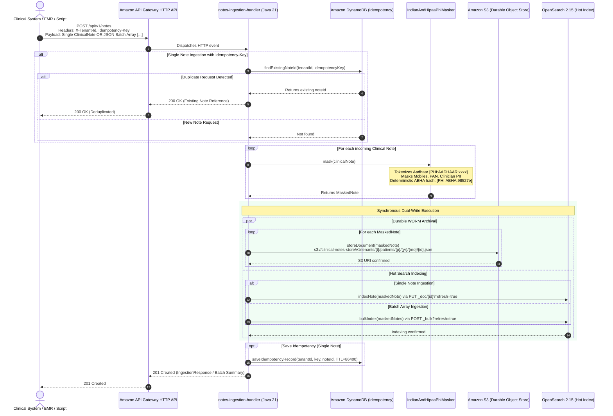
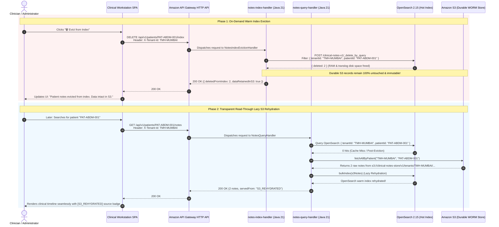

# Clinical Notes Aggregator System

> **Synchronous High-Volume Concurrent Reads & Writes for Multi-Hospital Healthcare Systems & Clinical EHR Integration with ABDM Consent Governance**

---

## 1. Problem Statement: The Multi-Center Oncology Challenge

### 1.1 The Distributed Cancer Care Journey
Cancer care is inherently complex, prolonged, and multi-modal. Unlike acute episodic illnesses, a patient's oncological journey rarely occurs within a single medical center. Patients routinely navigate across multiple independent healthcare institutions throughout their treatment:
* **Tertiary Surgical Center (e.g., Tata Memorial Hospital, Mumbai)**: Initial clinical presentation, diagnostic biopsies, oncopathology staging, genomic biomarker profiling, and primary surgical resection (e.g., Modified Radical Mastectomy).
* **Regional Daycare / Chemotherapy Center (e.g., Apollo Hospitals, Bengaluru)**: Cycles of adjuvant systemic therapy (chemotherapy regimens, targeted therapy, immunotherapy) and frequent hematology/toxicology monitoring closer to the patient's home.
* **Specialized Radiation Oncology Institute (e.g., AIIMS, New Delhi)**: High-precision radiotherapy planning (3D-CRT, IMRT, stereotactic radiosurgery), brachytherapy, and long-term survivorship care planning.

### 1.2 The Clinical Data Sharing Dilemma
While longitudinal continuity of care is vital for patient safety and survival, sharing clinical information across independent healthcare institutions presents severe operational and technical hurdles:
* **Disparate & Siloed EHR Systems**: Hospitals deploy incompatible, proprietary EMR/HIMS platforms with divergent database schemas and proprietary terminologies, making deep point-to-point EHR integrations practically unfeasible.
* **Structured Data Limitations**: Conventional healthcare interoperability models focus predominantly on discrete structured fields (such as numerical lab results, vitals, or ICD billing codes). However, structured codes alone **fail to capture the medical reasoning, clinical context, and complex multidisciplinary deliberations** essential in oncology.
* **Multi-Tenant Data Privacy & Regulatory Governance**: Each hospital operates as an independent data custodian under strict privacy laws and national digital frameworks (such as India's Ayushman Bharat Digital Mission - ABDM). Indiscriminate or unconsented cross-hospital data access is legally and ethically prohibited.

### 1.3 The Vital Role of Context-Rich Clinical Notes
Clinical notes authored by treating physicians—including **operative summaries, histopathology interpretations, tumor board deliberations, chemotherapy cycle toxicity evaluations, and radiation treatment plans**—represent the richest, most critical source of medical intelligence.

These unstructured and semi-structured clinical narratives preserve the crucial **"why"** behind past treatments and decisions that structured tables cannot convey:
1. **Past Treatment Decisions & Regimen Modifications**: *Why was a chemotherapy dose reduced, paused, or substituted (e.g., subtle emerging peripheral neuropathy, subclinical cardiotoxicity, or adverse reaction)?*
2. **Intraoperative Findings & Surgical Nuance**: *What exact surgical margins, tissue planes, or micro-metastases were observed during surgery?*
3. **Cumulative Dosimetry & Prior Interventions**: *What cumulative radiation dosage was delivered to adjacent organs at risk (OAR)?*
4. **Tumor Board Consensus & Prognostic Nuance**: *What multidisciplinary rationale justified deviating from standard first-line clinical pathways for this specific patient?*

Without rapid, secure access to these context-rich doctor notes, oncologists at subsequent treatment centers face dangerous diagnostic blind spots—leading to treatment delays, redundant and expensive repeat biopsies, conflicting drug interactions, or inappropriate re-irradiation.

The **Clinical Notes Aggregator System** resolves this fundamental dilemma by providing **sub-second, full-text searchable, consent-governed clinical notes retrieval** across hospital tenants—empowering downstream clinicians with immediate, comprehensive longitudinal context of the patient's entire journey.

---

## 2. Executive Summary & Architecture Overview

The **Clinical Notes Aggregator System** is an enterprise-grade, high-throughput clinical document aggregation, indexing, and retrieval platform designed for complex healthcare networks (incorporating Medical Oncology, Radiation Oncology, Pathology/Labs, and Surgical/OT workflows). 

The platform addresses two critical challenges in modern healthcare:
1. **Multi-Tenant Data Isolation with ABDM Digital Consent Governance**: In oncology care, a patient visits multiple independent hospital facilities. Under India's **Ayushman Bharat Digital Mission (ABDM)**, each hospital maintains strict multi-tenant isolation. By default, queries are strictly scoped to the local hospital tenant. Cross-hospital clinical notes are accessible **only** upon presentation of a valid, live digital ABDM Consent Artefact (`X-Consent-Artefact-Id`). If consent is expired, cross-hospital access is strictly prohibited and blocked with clinical warnings.
2. **High-Performance Hot Indexing + Durable Object Storage Lifecycle**: The system employs a dual-tier storage architecture combining **OpenSearch 2.15** (low-latency warm search index) with **Amazon S3** (durable, immutable Write-Once-Read-Many object storage). Ingestion performs a synchronous dual-write. If an active patient record is absent from OpenSearch (cache miss or post-eviction), the Query Handler automatically triggers **lazy rehydration from S3**, reconstructing the search index on-the-fly without data loss.

```mermaid
flowchart LR
    %% Source Applications
    subgraph Sources["Source Applications (Hospital Tenants)"]
        direction TB
        S1["TMH Mumbai (Surgery/Path)"]
        S2["Apollo Bengaluru (Med Onc)"]
        S3["AIIMS New Delhi (Rad Onc)"]
        S4["Hospital EMRs / OT"]
    end

    %% Ingestion & Privacy
    IngestAPI["<b>Ingestion API</b><br/>(AWS Lambda Java 21)<br/>• Batch & Single Note Ingestion<br/>• DynamoDB Deduplication"]
    PHIMask["<b>Inline PHI Masking</b><br/>(Indian & HIPAA Engine)<br/>• Aadhaar, Phone, Clinician De-ID<br/>• ABHA ID Tokenization"]

    %% Storage Tiers
    ES[("<b>OpenSearch 2.15 (Hot Index)</b><br/>• Near-real-time Search Index<br/>• Multi-tenant Routing & Sharding<br/>• Eviction on Demand")]
    ObjStore[("<b>Durable Amazon S3 Store</b><br/>• Partitioned: <i>tenants/{t}/patients/{p}</i><br/>• Immutable Source of Truth<br/>• WORM Compliant Archive")]

    %% Query & Governance Layer
    SearchAPI["<b>Search & Query API</b><br/>(AWS Lambda Java 21)<br/>• Default Home Tenant Scoping<br/>• ABDM Consent Evaluation<br/>• Lazy S3 Rehydration"]

    %% Consumers
    subgraph Consumers["Clinical Consumers & Portals"]
        direction TB
        C1["Workstation SPA (Nginx)"]
        C2["Hospital EMRs"]
        C3["ABDM PHR Apps"]
        C4["SMART on FHIR Clients"]
    end

    %% Ingestion Flow
    S1 & S2 & S3 & S4 --> IngestAPI
    IngestAPI --> PHIMask
    PHIMask -->|"Synchronous Index"| ES
    PHIMask -->|"Synchronous Archive"| ObjStore

    %% Query Flow
    Consumers <-->|"Read Requests"| SearchAPI
    SearchAPI <-->|"(1) Fast Warm Index Hit"| ES
    SearchAPI -.->|"(2) Cache Miss: Lazy Rehydration"| ObjStore
    ObjStore -.->|"(3) Re-index into OpenSearch"| ES

    %% Styling
    classDef srcStyle fill:#dbeafe,stroke:#3b82f6,stroke-width:2px,color:#1e3a8a;
    classDef ingestStyle fill:#fed7aa,stroke:#f97316,stroke-width:2px,color:#7c2d12;
    classDef phiStyle fill:#dcfce7,stroke:#22c55e,stroke-width:2px,color:#14532d;
    classDef esStyle fill:#fee2e2,stroke:#ef4444,stroke-width:2px,color:#7f1d1d;
    classDef queryStyle fill:#f3e8ff,stroke:#a855f7,stroke-width:2px,color:#581c87;
    classDef storeStyle fill:#f1f5f9,stroke:#64748b,stroke-width:2px,stroke-dasharray: 4 4,color:#0f172a;

    class S1,S2,S3,S4,C1,C2,C3,C4 srcStyle;
    class IngestAPI ingestStyle;
    class PHIMask phiStyle;
    class ES esStyle;
    class SearchAPI queryStyle;
    class ObjStore storeStyle;
```



---

## 3. System Components & Implementation Design

### 3.1 Ingestion API (`notes-ingestion-handler`)
* **Role**: Serves as the high-throughput, stateless entry gateway for all source clinical applications.
* **Characteristics**:
  * **Serverless & Horizontally Scalable**: Deployed on **AWS Lambda** (Java 21 with SnapStart) fronted by **Amazon API Gateway HTTP API** (`POST /api/v1/notes`).
  * **Single-Note & Bulk Batch Support**: Accepts single note objects or JSON arrays of notes (e.g., 50–200 notes per request) to ingest a patient's historical records across facilities in a single HTTP round-trip.
  * **Idempotency & Deduplication**: Employs client-provided `Idempotency-Key` headers or deterministic composite keys (`TenantId:SourceSystem:SourceRecordId:AuthoredAt`) verified against **Amazon DynamoDB** (or Redis) to guarantee zero duplicate records during network retries.
  * **Synchronous Dual-Write**: Persists every record synchronously to durable S3 object storage and indexes it into the OpenSearch cluster before returning `201 Created`.



### 3.2 Inline PHI Masking Engine (`IndianAndHipaaPhiMasker`)
* **Role**: Real-time data protection boundary applied immediately upon note ingestion prior to indexing or archiving.
* **Capabilities**:
  * **Indian Healthcare Identifiers**: Identifies and tokenizes 12-digit Indian Aadhaar numbers (`[PHI:AADHAAR:xxxx]`), 10-digit mobile numbers, PAN numbers, and 14-digit ABDM **ABHA numbers** (`14-xxxx-xxxx-xxxx`).
  * **Deterministic ABHA Tokenization**: Hashes ABHA IDs into deterministic 6-character tokens (`[PHI:ABHA:<sha256-prefix>]`). This guarantees that patients can be queried across hospital tenants using either their raw 14-digit ABHA ID or the masked token without exposing unmasked identifiers in search query logs.
  * **HIPAA Safe Harbor**: Redacts clinician personal contact details, patient addresses, and direct identifiers.

### 3.3 Hot Indexing Layer: OpenSearch 2.15 Cluster
* **Role**: Low-latency, high-concurrency search and indexing engine providing sub-second query evaluation across millions of clinical records.
* **Design & Operational Characteristics**:
  * **Index Structure**: Standardized `clinical-notes-v1` index with custom analyzers, n-gram substring matchers, and medical synonym dictionaries.
  * **Multi-Tenant Routing**: Documents are stored with `tenantId`, `patientId`, `demographics.abhaId`, `noteType`, and `authoredAt`.
  * **Zero Data Loss on Stop**: OpenSearch writes transactions to translogs and flushes to disk. Even if the hosting EC2 instance or container is stopped, index data persisted on EBS volumes remains completely intact.

### 3.4 Durable Tenant-Oriented Object Store (Amazon S3)
* **Role**: Immutable, durable Write-Once-Read-Many (WORM) source of truth partitioned strictly by tenant and patient.
* **Storage Hierarchy**:
  ```
  s3://clinical-notes-store/v1/tenants/{tenantId}/patients/{patientId}/{year}/{month}/{noteId}.json
  ```
* **Separation of Concerns**:
  * While OpenSearch serves active search and timeline views, Amazon S3 provides 11 9's of durability (`99.999999999%`).
  * Full JSON note documents, raw clinical text, and structured section payloads are permanently archived in S3.

### 3.5 Query & Retrieval API (`notes-query-handler`)
* **Role**: Delivers sub-50ms query responses for clinician workstation timelines, EMR integration, and FHIR clients (`GET /api/v1/patients/{patientId}/notes`).
* **Two-Tier Retrieval Engine**:
  * **Tier 1 (Warm Index Hit)**: Queries OpenSearch directly using `tenantId` and `patientId` (or `abhaId`). Returns hits with execution origin `"INDEX"`.
  * **Tier 2 (Cache Miss Lazy S3 Rehydration)**: If OpenSearch returns 0 notes for a single-tenant request, the Lambda automatically calls `S3DocumentStore.fetchAllByPatient(tenantId, patientId)`, bulk-indexes the restored documents into OpenSearch, and returns the results with execution origin `"S3_REHYDRATED"`. Subsequent queries immediately hit Tier 1.

### 3.6 Warm Index Eviction Engine (`DELETE /api/v1/patients/{patientId}/index`)
* **Role**: Enables on-demand or automated index footprint reclamation for inactive patients.
* **Mechanism**:
  * Deletes a patient's documents from the OpenSearch cluster while leaving their durable S3 records untouched.
  * Returns `200 OK` with `deletedFromIndex: N`, `dataRetainedInS3: true`.
  * If the patient returns to the clinic, the first query automatically triggers lazy S3 rehydration.



### 3.7 ABDM Consent & Multi-Tenant Governance
* **Role**: Enforces India's ABDM digital consent guidelines and cross-hospital access policies.
* **Governance Model**:
  1. **Strict Local Tenant Isolation by Default**:
     - When a clinician searches by **Patient ID** (e.g., `PAT-ABDM-001`), the query is strictly bound to the clinician's home hospital tenant (e.g., `TMH-MUMBAI`).
     - Notes from other hospitals (`APOLLO-BLR`, `AIIMS-DEL`) are **never** returned, even if the patient has records there.
  2. **Automated ABHA Resolution**:
     - Local search resolves and auto-populates the patient's national 14-digit ABHA ID into the ABDM lookup box.
  3. **Tenant-Specific Consent Evaluation**:
     - Selecting a remote hospital evaluates that facility's specific consent artefact:
       - **LIVE**: Full clinical notes from that hospital are retrieved and displayed.
       - **EXPIRED**: Access is strictly blocked (`0 notes returned`). The UI displays an explicit ABDM warning card with consent details, expiry timestamp, and a direct action to request renewal via the ABDM PHR app.
  4. **Federated Multi-Hospital View ("ALL")**:
     - Selecting "ALL Hospitals" aggregates notes across all facilities holding **LIVE** consent.
     - If any participating hospital has an expired consent, an ABDM notification warning banner is displayed at the top of the timeline explicitly listing excluded facilities and records.

### 3.8 ABDM Consent & Retrieval Sequence Flow

The diagram below reflects the **exact deployed implementation flow** between the Clinical Workstation SPA (`app.js`), Amazon API Gateway HTTP API, `notes-query-handler` (AWS Lambda), OpenSearch 2.15 (Hot Index), and Amazon S3 (Durable Object Store with Lazy Rehydration):

```mermaid
sequenceDiagram
    autonumber
    actor Clinician as Clinician (TMH-MUMBAI)
    participant SPA as Clinical Workstation SPA (app.js)
    participant APIGW as Amazon API Gateway HTTP API
    participant Lambda as notes-query-handler (Java 21)
    participant OS as OpenSearch 2.15 (Hot Index)
    participant S3 as Amazon S3 (Durable WORM Store)

    %% Scenario A: Local Patient ID Search
    rect rgb(240, 249, 255)
    Note over Clinician,S3: Scenario A: Local Patient ID Search (Strict Scoping to Home Facility)
    Clinician->>SPA: Enters Patient ID "PAT-ABDM-001" & clicks Search
    SPA->>SPA: Directory lookup: resolves ABHA "14-8765-4321-9876", auto-populates ABHA box
    SPA->>SPA: Scopes target facility strictly to current hospital: "TMH-MUMBAI"
    SPA->>APIGW: GET /api/v1/patients/PAT-ABDM-001/notes<br/>Header: X-Tenant-Id: TMH-MUMBAI
    APIGW->>Lambda: Dispatches request to notes-query-handler
    Lambda->>OS: Query OpenSearch: { tenantId: "TMH-MUMBAI", patientId: "PAT-ABDM-001" }
    alt Warm Index Hit (Data in OpenSearch)
        OS-->>Lambda: Returns 2 notes (Operative Note, Biopsy) [servedFrom: INDEX]
    else Cache Miss / Post-Eviction (0 notes in OpenSearch)
        OS-->>Lambda: 0 hits
        Lambda->>S3: fetchAllByPatient("TMH-MUMBAI", "PAT-ABDM-001")
        S3-->>Lambda: Returns raw notes from s3://clinical-notes-store/v1/tenants/TMH-MUMBAI/...
        Lambda->>OS: bulkIndex(s3Notes) (Lazy Rehydration)
        OS-->>Lambda: Index rehydrated
        Lambda-->>Lambda: Re-queries OpenSearch [servedFrom: S3_REHYDRATED]
    end
    Lambda-->>APIGW: 200 OK (2 TMH notes)
    APIGW-->>SPA: 200 OK
    SPA-->>Clinician: Renders 2 TMH notes. Apollo & AIIMS records strictly isolated!
    end

    %% Scenario B: Remote Hospital Selection with LIVE Consent
    rect rgb(240, 253, 244)
    Note over Clinician,S3: Scenario B: Remote Hospital Selection with LIVE Consent (APOLLO-BLR)
    Clinician->>SPA: Selects "APOLLO-BLR" from Hospital Record dropdown
    SPA->>SPA: Checks consent status: CONSENT-ABDM-9901-APOLLO is LIVE (Valid till 31 Dec 2026)
    SPA->>APIGW: GET /api/v1/patients/PAT-ABDM-001/notes<br/>Headers: X-Tenant-Id: APOLLO-BLR, X-Consent-Artefact-Id: CONSENT-ABDM-9901-APOLLO
    APIGW->>Lambda: Dispatches query with remote tenant
    Lambda->>OS: Query OpenSearch: { tenantId: "APOLLO-BLR", patientId: "PAT-ABDM-001" }
    OS-->>Lambda: Returns 2 notes (Chemo AC-T Cycle 3, CBC Lab Report) [servedFrom: INDEX]
    Lambda-->>APIGW: 200 OK
    APIGW-->>SPA: 200 OK
    SPA-->>Clinician: Displays Apollo notes with green [LIVE Consent] badge
    end

    %% Scenario C: Remote Hospital Selection with EXPIRED Consent
    rect rgb(254, 242, 242)
    Note over Clinician,S3: Scenario C: Remote Hospital Selection with EXPIRED Consent (AIIMS-DEL)
    Clinician->>SPA: Selects "AIIMS-DEL" from Hospital Record dropdown
    SPA->>SPA: Inspects consent status: CONSENT-ABDM-8802-AIIMS is EXPIRED (Expired 31 Aug 2026)
    Note over SPA: ABDM HIU Policy Enforcement: Viewing notes without active consent is prohibited
    SPA-->>SPA: Blocks query execution! Zero backend calls dispatched
    SPA-->>Clinician: Hides timeline, displays "Access Restricted: ABDM Consent Expired" Warning Card with renewal action
    end

    %% Scenario D: Federated ALL View with Exclusion Notice
    rect rgb(254, 243, 199)
    Note over Clinician,S3: Scenario D: Federated ALL View (Aggregated Timeline with Notice)
    Clinician->>SPA: Selects "ALL — All ABDM Facilities (Federated View)"
    SPA->>SPA: Scans tenant consents: AIIMS is EXPIRED; TMH & Apollo are LIVE
    SPA->>SPA: Displays yellow Warning Banner: "Records from AIIMS-DEL excluded due to expired consent"
    SPA->>APIGW: GET /api/v1/patients/PAT-ABDM-001/notes<br/>Headers: X-Tenant-Id: ALL, X-Consent-Artefact-Id: CONSENT-ABDM-9901-APOLLO
    APIGW->>Lambda: Dispatches federated query
    Lambda->>OS: Query OpenSearch across all tenants for PAT-ABDM-001
    OS-->>Lambda: Returns notes across participating tenants
    Lambda-->>APIGW: 200 OK
    APIGW-->>SPA: 200 OK
    SPA->>SPA: Excludes unauthorized expired tenant records (AIIMS-DEL)
    SPA-->>Clinician: Renders 4 permitted notes (2 TMH + 2 Apollo) in chronological timeline
    end
```

* **Target Enterprise ABDM Gateway Integration (Milestones M2/M3 Roadmap)**:
  In enterprise deployments interfacing with the national ABDM network:
  1. **Consent Request Initiation**: The hospital's Health Information User (HIU) system initiates a consent directive via `POST /v0.5/consent-requests/init` against the national ABDM Gateway.
  2. **Patient Approval on ABHA Mobile App**: The patient approves access via OTP/biometric signature on their registered ABDM PHR app.
  3. **Asynchronous Webhook Callback (`/notify`)**: The ABDM Gateway dispatches an asynchronous callback `POST /api/v1/abdm/consent/notify` to the Notes Aggregator. The handler calls `POST /v0.5/consents/fetch`, downloads the signed artefact JSON, and caches it in **Amazon DynamoDB** (`abdm-consent-registry`) keyed by `patientAbha#targetTenantId`.
  4. **OAuth 2.0 / JWT Claim Presentation**: In enterprise SSO environments, the consent ID is verified and embedded within the clinician's signed OAuth 2.0 Bearer JWT (`abdm_consent_id` claim) for tamper-proof ABAC authorization.

---

## 4. Policy & Authorization Rules

| Request Context | Headers & Parameters Passed | Resolved Tenant | Access Decision & Returned Data |
| :--- | :--- | :--- | :--- |
| **Default Local Search** | `X-Tenant-Id: TMH-MUMBAI` | `TMH-MUMBAI` | **Strict Isolation**: Only notes authored by `TMH-MUMBAI` are returned. All remote records are omitted. |
| **Remote Hospital (LIVE Consent)** | `X-Tenant-Id: APOLLO-BLR`<br>`X-Consent-Artefact-Id: CONSENT-ABDM-9901-APOLLO` | `APOLLO-BLR` | **Authorized**: Notes authored by Apollo Hospitals are displayed (`2 notes`). |
| **Remote Hospital (EXPIRED Consent)** | `X-Tenant-Id: AIIMS-DEL`<br>`X-Consent-Artefact-Id: CONSENT-ABDM-8802-AIIMS` | `AIIMS-DEL` | **Blocked**: 0 notes returned. Warning card displayed in UI with ABDM policy compliance notice and renewal action. |
| **Federated All-Hospital View** | `X-Tenant-Id: ALL`<br>`X-Consent-Artefact-Id: CONSENT-ABDM-9901-APOLLO` | `ALL` | **Federated with Exclusion**: Aggregates `TMH-MUMBAI` and `APOLLO-BLR`. AIIMS records are excluded; notification banner displayed. |
| **Direct ABHA ID Search** | `GET /api/v1/patients/14-8765-4321-9876/notes` | `ALL` / specified | Resolves cross-tenant notes matching either raw ABHA ID or masked token `[PHI:ABHA:98527e]`. |

---

## 5. API Specifications

### 5.1 Ingestion API: Write Single Note or Bulk Batch
* **Method & Path**: `POST /api/v1/notes`
* **Headers**:
  * `Content-Type: application/json`
  * `X-Tenant-Id: <tenantId>`
  * `Idempotency-Key: <unique-key>` (Optional but recommended)

#### Single Note Payload:
```json
{
  "tenantId": "TMH-MUMBAI",
  "sourceSystem": "MOIS",
  "facilityId": "TMH-ACTREC-01",
  "patientId": "PAT-ABDM-001",
  "encounterId": "ENC-45129",
  "noteType": "SURGICAL_OPERATIVE",
  "author": {
    "clinicianId": "DOC-7712",
    "name": "Dr. Sarah Jenkins, MS MCh",
    "department": "Surgical Oncology"
  },
  "demographics": {
    "abhaId": "14-8765-4321-9876",
    "gender": "Female",
    "age": 52
  },
  "timestamps": {
    "authoredAt": "2026-08-18T10:30:00Z",
    "recordedAt": "2026-08-18T10:32:15Z"
  },
  "content": {
    "format": "application/json",
    "title": "Modified Radical Mastectomy Operative Note",
    "sections": {
      "findings": "Right breast upper outer quadrant mass measuring 3.2 cm.",
      "procedure": "Right modified radical mastectomy with level I/II axillary dissection."
    },
    "rawText": "Modified Radical Mastectomy performed without intraoperative complications..."
  }
}
```

#### Batch Array Payload:
Accepts `[ { ...note1 }, { ...note2 } ]` in a single POST request.

#### Single Note Response (`201 Created`):
```json
{
  "status": "SUCCESS",
  "noteId": "NOTE-TMH-BRCA-001",
  "tenantId": "TMH-MUMBAI",
  "patientId": "PAT-ABDM-001",
  "indexedAt": "2026-09-17T10:32:15.184Z",
  "storageUri": "s3://clinical-notes-store/v1/tenants/TMH-MUMBAI/patients/PAT-ABDM-001/2026/09/NOTE-TMH-BRCA-001.json"
}
```

#### Batch Array Response (`201 Created`):
```json
{
  "status": "SUCCESS",
  "mode": "BATCH",
  "totalIngested": 3,
  "patientId": "PAT-ABDM-001",
  "noteIds": [
    "NOTE-TMH-BRCA-001",
    "NOTE-APOLLO-CHEMO-001",
    "NOTE-AIIMS-RAD-001"
  ]
}
```

---

### 5.2 Query API: Search & Retrieve Patient Notes
* **Method & Path**: `GET /api/v1/patients/{patientId}/notes`
* **Headers**:
  * `X-Tenant-Id: <tenantId>` (`TMH-MUMBAI`, `APOLLO-BLR`, or `ALL`)
  * `X-Consent-Artefact-Id: <consentId>` (Required for remote/cross-tenant queries)
* **Query Parameters**:
  * `page`: 1-based page index (default: 1)
  * `limit`: records per page (default: 20)
  * `crossTenant`: `true` / `false`

#### Response (`200 OK`):
```json
{
  "patientId": "PAT-ABDM-001",
  "tenantId": "TMH-MUMBAI",
  "totalNotes": 2,
  "page": 1,
  "limit": 20,
  "servedFrom": "INDEX",
  "notes": [
    {
      "noteId": "NOTE-TMH-BRCA-001",
      "noteType": "SURGICAL_OPERATIVE",
      "author": {
        "clinicianId": "DOC-7712",
        "name": "Dr. Sarah Jenkins, MS MCh",
        "department": "Surgical Oncology"
      },
      "authoredAt": "2026-08-18T10:30:00Z",
      "recordedAt": "2026-08-18T10:32:15Z",
      "sourceSystem": "MOIS",
      "facilityId": "TMH-ACTREC-01",
      "summary": "Modified Radical Mastectomy Operative Note",
      "storageUri": "/api/v1/notes/NOTE-TMH-BRCA-001/document",
      "tenantId": "TMH-MUMBAI"
    }
  ]
}
```
> **Note on `servedFrom`**: Returns `"INDEX"` when served directly from the OpenSearch warm tier, or `"S3_REHYDRATED"` when transparently restored from S3 following an eviction or cache miss.

---

### 5.3 Index Management API: Evict Patient from Warm Index
* **Method & Path**: `DELETE /api/v1/patients/{patientId}/index`
* **Headers**: `X-Tenant-Id: <tenantId>`

#### Response (`200 OK`):
```json
{
  "patientId": "PAT-ABDM-001",
  "tenantId": "TMH-MUMBAI",
  "deletedFromIndex": 2,
  "dataRetainedInS3": true,
  "message": "Patient data evicted from warm index. Data intact in S3. Next read will rehydrate automatically."
}
```

---

### 5.4 FHIR R4 Interoperability Facade
The system includes an HL7 FHIR R4 compliant facade supporting DocumentReference retrieval, searchset bundles, and ingestion:
* **CapabilityStatement**: `GET /fhir/r4/metadata`
* **Patient Document Searchset**: `GET /fhir/r4/DocumentReference?patient={patientId}&_count=20&_offset=0` (Supports `patient.identifier=https://abdm.gov.in/abha|14-8765-4321-9876`)
* **Individual Document Read**: `GET /fhir/r4/DocumentReference/{noteId}`
* **Document Ingestion via FHIR**: `POST /fhir/r4/DocumentReference`
* **Patient Everything Compartment**: `GET /fhir/r4/Patient/{patientId}/$everything`

---

## 6. Deployment Infrastructure & Operational Endpoints

### 6.1 Live Deployed Architecture
* **Public Web Client (SPA)**: `http://13.202.49.76/` (Nginx on AWS EC2)
* **Backend API Gateway**: `https://l64zo3f94g.execute-api.ap-south-1.amazonaws.com`
* **OpenSearch Cluster**: Port 9200 on EC2 instance (`ap-south-1`)
* **Durable Storage**: Amazon S3 (`s3://clinical-notes-store`)
* **Lambda Handlers**:
  * `notes-ingestion-handler` (`NotesIngestionHandler`)
  * `notes-query-handler` (`NotesQueryHandler`)
  * `notes-index-handler` (`NotesIndexEvictionHandler`)
  * `notes-fhir-handler` (`NotesFhirHandler`)

### 6.2 Data Durability & EC2 Stop / Restart Resilience
* **OpenSearch Storage Persistence**: OpenSearch is deployed with Docker volume mapping to the EC2 host's persistent EBS volume (`/var/lib/docker/volumes/...`). Stopping the EC2 instance does **not** cause data loss.
* **AWS Cost Optimization**: When the EC2 instance is stopped, AWS charges only for the EBS storage volume (~$0.08/GB-month) with $0.00 compute charges.
* **Immutable S3 Backup**: Even if the entire OpenSearch cluster or EC2 instance is terminated, the Query Handler's **lazy S3 rehydration** automatically restores the search index upon initial access.

---

## 7. Presentation & Web UI Workflow

The Clinical Workstation SPA (`http://13.202.49.76/`) implements a clear, 3-step ABDM workflow:

1. **Step 1: Local Patient ID Lookup (Current Facility)**:
   - Clinician enters local patient ID (e.g. `PAT-ABDM-001`).
   - Query is strictly scoped to the clinician's facility (`TMH-MUMBAI`).
   - Default search returns only local notes (e.g. 2 notes).
   - System automatically resolves and displays the patient's ABDM ABHA ID (`14-8765-4321-9876`).

2. **Step 2: Hospital Record Selector & Tenant Consent**:
   - Clinician selects a specific hospital record from the dropdown.
   - Consent status card displays live/expired status and consent artefact ID.
   - **Apollo Bengaluru (`APOLLO-BLR`)**: Consent is `LIVE` (`CONSENT-ABDM-9901-APOLLO`) → chemotherapy and lab notes load seamlessly with green badge.
   - **AIIMS New Delhi (`AIIMS-DEL`)**: Consent is `EXPIRED` (`CONSENT-ABDM-8802-AIIMS`) → Timeline is replaced with an explicit ABDM warning card; 0 notes are displayed; clinician is prompted to initiate consent renewal via the patient's ABDM PHR app.

3. **Step 3: All Hospitals (Federated View)**:
   - Clinician selects `ALL Hospitals (Federated Timeline)`.
   - Notes from authorized facilities (`TMH-MUMBAI` + `APOLLO-BLR`) are chronologically merged.
   - A prominent warning notification banner appears at the top:
     > *"ABDM Notice: Certain Hospital Records Excluded Due to Expired Consent. Records from AIIMS-DEL (AIIMS, New Delhi) are excluded due to expired consent artefact CONSENT-ABDM-8802-AIIMS."*

4. **Index Eviction Demonstration**:
   - Clinician clicks `🗑 Evict from Index`.
   - Patient's notes are removed from OpenSearch via `DELETE /api/v1/patients/{patientId}/index`.
   - Clicking `Search` again demonstrates **Lazy S3 Rehydration**, restoring notes from S3 with execution origin `"S3_REHYDRATED"`.
