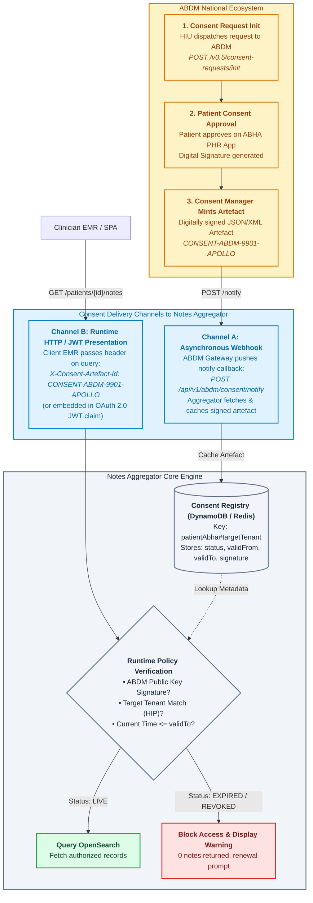

# ABDM Consent Workflow & Cross-Tenant Clinical Notes Guide

This guide documents the architecture, policy rules, automated test cases, test data, and verification steps for **ABDM Consent-driven Cross-Hospital Multi-Tenant Notes Aggregation** in the Clinical Notes Aggregator.

---

## 1. Problem Context & ABDM Architecture

### The Multi-Hospital Cancer Journey
In Indian oncology care, a cancer patient frequently visits multiple independent hospitals for different modalities of care:
1. **Hospital A (e.g. Tata Memorial Hospital, Mumbai - `TMH-MUMBAI`)**: Initial presentation, biopsy, oncopathology, and primary surgery (e.g. Modified Radical Mastectomy).
2. **Hospital B (e.g. Apollo Hospitals, Bengaluru - `APOLLO-BLR`)**: Adjuvant chemotherapy (e.g. AC-T regimen) and frequent hematology lab monitoring closer to home.
3. **Hospital C (e.g. AIIMS, New Delhi - `AIIMS-DEL`)**: Specialized radiation oncology (e.g. 3D-CRT / IMRT) and long-term survivorship care planning.

Each hospital operates as an independent tenant with strict data isolation.

### How ABDM & ABHA Connect the Journey
Under India's **Ayushman Bharat Digital Mission (ABDM)**:
- Every citizen has a unique **14-digit ABHA ID** (e.g., `14-8765-4321-9876`) and an ABHA address (e.g., `anita.deshmukh@abdm`).
- Every clinical note ingested from any hospital tenant records this ABHA ID in `demographics.abhaId`.
- **PHI Masking Engine (`IndianAndHipaaPhiMasker`)**: Deterministically masks ABHA IDs to safe tokens (`[PHI:ABHA:<6-char-sha256>]`), ensuring privacy compliance while preserving deterministic cross-tenant searchability.
- **Tenant-Specific ABDM Consent Artefacts (`X-Consent-Artefact-Id`)**: When a patient grants digital consent (via ABDM PHR app or Health Information User application), a signed consent artefact is issued for specific care contexts and facilities with defined validity dates.

---

## 2. Policy & Authorization Rules

| Request Context | Headers Passed | Resolved Tenant | Returned Data & Clinical Behavior |
| :--- | :--- | :--- | :--- |
| **Default Local Search** | `X-Tenant-Id: TMH-MUMBAI` | `TMH-MUMBAI` | **Strict Tenant Isolation**: Only notes authored by `TMH-MUMBAI` are returned (2 notes). Even if remote records exist with valid or expired consents, they are strictly omitted. |
| **Remote Hospital (LIVE Consent)** | `X-Tenant-Id: APOLLO-BLR`<br>`X-Consent-Artefact-Id: CONSENT-ABDM-9901-APOLLO` | `APOLLO-BLR` | **Authorized**: Notes authored by Apollo Hospitals are displayed (`2 notes`). |
| **Remote Hospital (EXPIRED Consent)** | `X-Tenant-Id: AIIMS-DEL`<br>`X-Consent-Artefact-Id: CONSENT-ABDM-8802-AIIMS` | `AIIMS-DEL` | **Access Restricted**: Prohibited by ABDM policy. UI displays an explicit warning card detailing expiry timestamp and blocked status; 0 notes are displayed. |
| **Federated All-Hospital View** | `X-Tenant-Id: ALL`<br>`X-Consent-Artefact-Id: CONSENT-ABDM-9901-APOLLO` | `ALL` | **Federated with Exclusion**: Aggregates records across authorized facilities (`TMH-MUMBAI` + `APOLLO-BLR` = 4 notes). Excludes AIIMS notes and displays an ABDM notification warning banner. |
| **Direct ABHA ID Search** | `GET /api/v1/patients/14-8765-4321-9876/notes` | `ALL` | Resolves records matching raw ABHA ID or masked token `[PHI:ABHA:98527e]`. |

---

## 3. Consent Sharing Mechanism: How Consent Reaches the Notes Aggregator



### Detailed Mechanism Breakdown:
1. **Out-of-Band Consent Request (ABDM M2/M3)**:
   - When a clinician at `TMH-MUMBAI` needs access to notes from `APOLLO-BLR`, the hospital HIU calls the ABDM Gateway (`POST /v0.5/consent-requests/init`).
   - The patient receives a push notification on their **ABHA mobile app** and signs the request.
   - The ABDM Consent Manager mints a signed artefact (`CONSENT-ABDM-9901-APOLLO`).

2. **Delivery Channel A — Asynchronous ABDM Webhook Ingestion**:
   - ABDM Gateway sends `POST /v0.5/consents/hiu/notify` to the hospital's registered webhook callback.
   - Notes Aggregator calls `POST /v0.5/consents/fetch`, downloads the signed artefact JSON, and caches it in **Amazon DynamoDB** (`abdm-consent-registry` table) with key `14-8765-4321-9876#APOLLO-BLR`.

3. **Delivery Channel B — Runtime Presentation (Headers & JWT Claims)**:
   - When querying notes via `GET /api/v1/patients/{patientId}/notes`, the client passes:
     - `X-Tenant-Id: APOLLO-BLR` (or `ALL`)
     - `X-Consent-Artefact-Id: CONSENT-ABDM-9901-APOLLO`
   - In SMART on FHIR deployments, this is packaged inside the signed JWT Access Token claim (`abdm_consent_id`).

4. **Runtime Verification**:
   - `notes-query-handler` inspects the cached artefact:
     - Confirms ABDM digital signature.
     - Confirms `hip.id == requestedTenantId`.
     - Confirms `validFrom <= now() <= validTo`.
   - If **LIVE**: Query executes against OpenSearch for `tenantId == APOLLO-BLR`.
   - If **EXPIRED**: Access is blocked, 0 notes are returned, and a renewal prompt is provided.

---

## 4. Draw.io Architecture & Process Flow Diagrams

For visual modeling of this process, refer to the Draw.io diagram in the repository:
👉 **[`design/architecture-and-dataflow.drawio`](file:///Users/dhananjaypatkar/work/ncg/source/notes_aggregator/design/architecture-and-dataflow.drawio)**

- **Tab 3: ABDM Consent & Federated Process Flow**:
  - Details the sequence from Clinician Login at `TMH-MUMBAI`, local patient search scoping, ABHA auto-population, tenant dropdown selection, consent evaluation, and federated warning notifications.
- **Tab 1 & 2**:
  - Illustrates the technical architecture (Hybrid AWS Serverless + EC2 OpenSearch 2.15) and data flow lifecycle (dual-write, warm index, lazy S3 rehydration, and eviction).

---

## 5. Automated Test Cases

The codebase includes automated unit and integration tests covering the ABDM consent workflow, tenant isolation, cross-tenant federation, and batch ingestion.

### Test Suites

1. **`NotesQueryHandlerTest.java`** (`source/notes-query-handler`):
   - `shouldEnforceTenantIsolationWhenSpecificTenantIsRequestedEvenWithConsent`: Verifies that requesting `X-Tenant-Id: TMH-MUMBAI` strictly returns notes belonging to TMH, preserving tenant isolation.
   - `shouldEnableCrossTenantFederationWhenConsentArtefactIsProvided`: Verifies that passing `X-Consent-Artefact-Id` with `X-Tenant-Id: ALL` queries OpenSearch across all tenants and returns notes with disparate `tenantId`s (`TMH-MUMBAI`, `APOLLO-BLR`, `AIIMS-DEL`).
   - `shouldEnforceTenantIsolationWhenConsentArtefactIsAbsent`: Verifies that without a consent artefact or explicit cross-tenant intent, queries are strictly confined to the local tenant.
   - `shouldEnableCrossTenantFederationWhenQueryParamCrossTenantIsTrue`: Verifies `?crossTenant=true` parameter.
   - `shouldSupportAbhaIdAsPatientIdentifierInPathWithConsent`: Verifies querying directly by ABHA ID `14-8765-4321-9876`.

2. **`NotesIngestionHandlerTest.java`** (`source/notes-ingestion-handler`):
   - `shouldSuccessfullyIngestBatchOfNotesInSinglePostCall`: Verifies that a JSON array of `[note1, note2, note3]` for a patient across different facilities is ingested, masked, stored in S3, and bulk-indexed into OpenSearch in a single `POST /api/v1/notes` call.
   - `shouldReturn400WhenBatchPayloadIsEmptyArray`: Verifies rejection of empty `[]` payload.
   - `shouldReturn400WhenBatchNoteHasMissingPatientId`: Verifies validation when any note in the batch lacks a `patientId`.

3. **`OpenSearchIndexClientTest.java`** (`source/notes-common`):
   - `shouldBuildStandardTenantAndPatientFilter`: Confirms single-tenant query builder.
   - `shouldOmitTenantFilterWhenTenantIsAll`: Confirms tenant filter omission for cross-hospital federated view.
   - `shouldBuildAbhaQueryWithBoolShouldMatchingRawAndMaskedTokens`: Confirms `bool.should` matching both raw ABHA ID and deterministic masked hash (`[PHI:ABHA:98527e]`).
   - `shouldProduceConsistentAbhaHash`: Verifies deterministic 6-character SHA-256 substring matching `IndianAndHipaaPhiMasker`.

### Running Automated Tests
```bash
cd source
mvn test
```
*Result: 100% Tests Pass across all modules (Total execution time: ~5.3 seconds).*

---